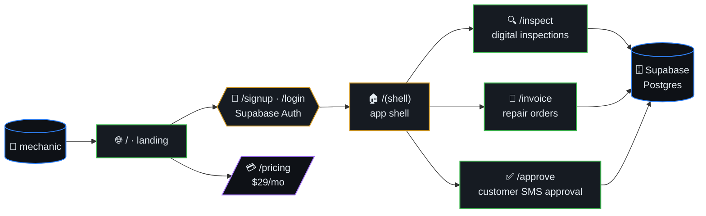
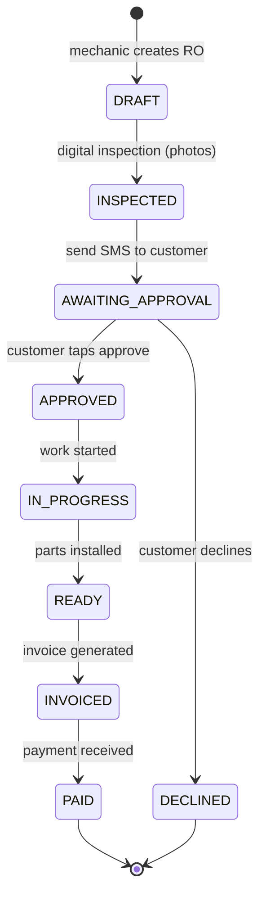
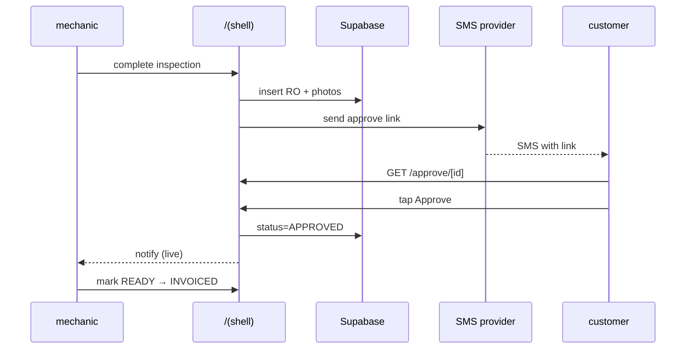
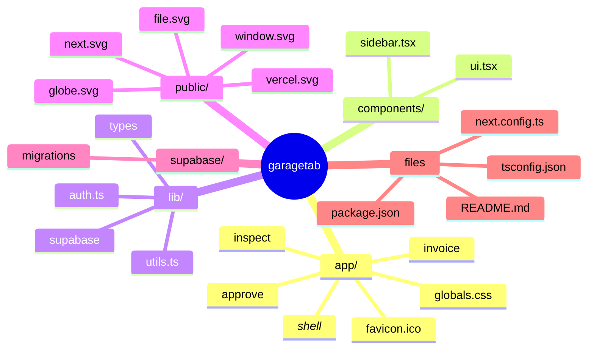
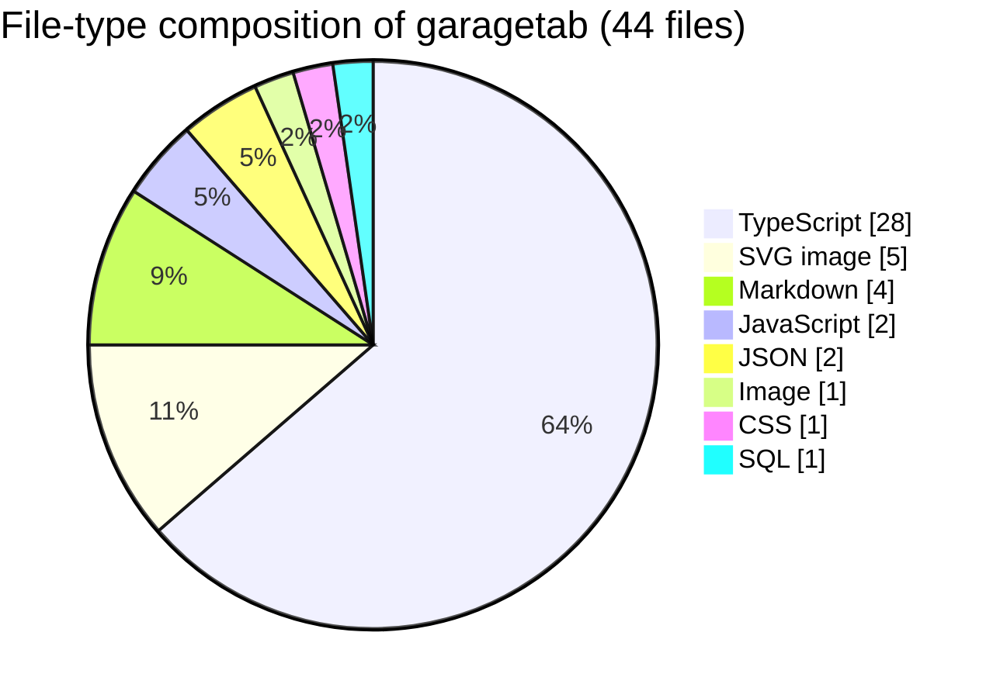

# GarageTab

> Lightweight shop management for independent auto repair shops (1-5
> bays). The $29/mo alternative to Tekmetric and Shop-Ware for solo
> mechanics. Sign up, add your first repair order in under 5 minutes.

**Tagline:** "Run your shop, not your software."



## Table of contents

- [Stack](#stack)
- [Architecture](#architecture)
- [Repair-order lifecycle](#repair-order-lifecycle)
- [Customer approval (sequence)](#customer-approval-sequence)
- [Getting Started](#getting-started)
- [Requirements](#requirements)
- [🗺️ Repository map](#️-repository-map)
- [📊 Code composition](#-code-composition)

## Repair-order lifecycle



## Customer approval (sequence)



## Stack

- Next.js 16 + React 19 + Tailwind CSS 4
- Supabase (auth + database)
- Vercel deployment
- TypeScript strict mode
- Bun package manager

## Architecture

- `/` — Landing page
- `/signup`, `/login` — Auth flows (Supabase)
- `/(shell)` — Authenticated app shell
- `/inspect` — Digital inspections (photos)
- `/invoice` — Repair orders + invoicing
- `/approve` — Customer approval via text
- `/pricing` — $29/mo flat

## Getting Started

```bash
bun install
bun run dev
```

Open [http://localhost:3000](http://localhost:3000).

## Requirements

See [REQUIREMENTS.md](REQUIREMENTS.md) for product vision, target customer, and competitive positioning.


## 🗺️ Repository map

Top-level layout of `garagetab` rendered as a Mermaid mindmap (auto-generated from the on-disk tree).




## 📊 Code composition

File-type breakdown of source under this repo (skips `.git`, `node_modules`, build caches, lockfiles).


